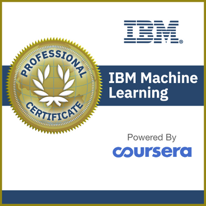

# Welcome to my coding world

Hello! I am Saikiran (Sai) Tharimena, a researcher with 6+ years of experience in numerical and statistical modeling, and machine learning. Having garnered invaluable experience in academic research, I am looking forward to switch careers to focus on leveraging the power of machine learning and deep learning to solve real-world challenges.

#Deep Learning &emsp; #Machine Learning &emsp; #Statistical Modeling &emsp; #Data Science

<b>Have an exciting opportunity in mind? Reach out to me<b/>
 [Resume](https://github.com/drsaikirant88/drsaikirant88.github.io/blob/main/Tharimena_Saikiran_Resume.pdf)

 

 [Click here to verify credentials](https://www.credly.com/badges/71bfefa6-5ff8-4609-813f-fdbbd9eb3edc?source=linked_in_profile)
  
Follow me:
 [Linkedin](https://www.linkedin.com/in/saikirantharimena/)
 [Google Scholar](https://scholar.google.co.uk/citations?user=HHIWRAkAAAAJ&hl=en)

## Projects
Here are a few sample projects on Machine Learning:

[Exploratory Data Analysis](https://github.com/drsaikirant88/drsaikirant88.github.io/blob/main/IBM%20Machine%20Learning/eda.ipynb)

[Supervised Regression](https://github.com/drsaikirant88/drsaikirant88.github.io/blob/main/IBM%20Machine%20Learning/regression.ipynb)

[Supervised Classification](https://github.com/drsaikirant88/drsaikirant88.github.io/blob/main/IBM%20Machine%20Learning/classification.ipynb)

[Unsupervised Learning](https://github.com/drsaikirant88/drsaikirant88.github.io/blob/main/IBM%20Machine%20Learning/unsupervised_learning.ipynb)

[Deep Learning](https://github.com/drsaikirant88/drsaikirant88.github.io/blob/main/IBM%20Machine%20Learning/deeplearning.ipynb)

Deep Learning using multiple GPUs and Horovod (https://horovod.ai/), a distributed deep learning framework
 [Deep Learning - GPUs](https://github.com/drsaikirant88/drsaikirant88.github.io/blob/main/IBM%20Machine%20Learning/classification_multigpu.ipynb)
